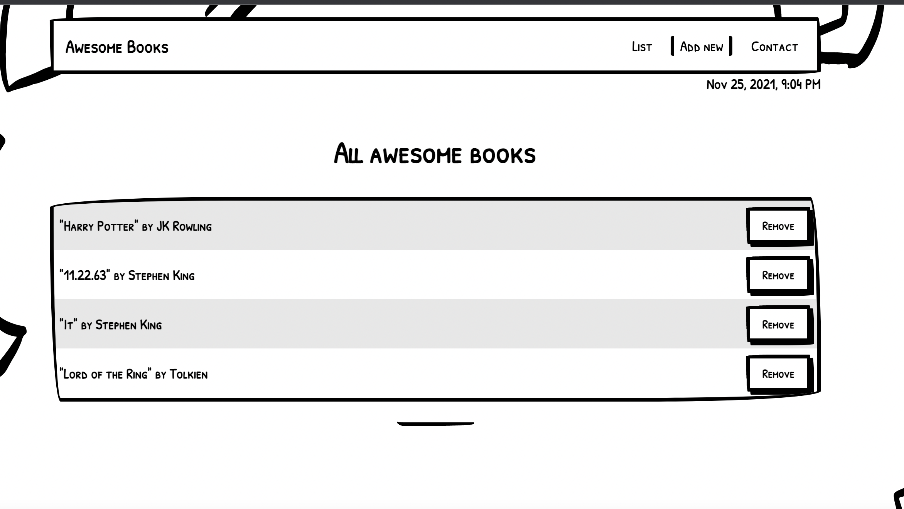

# Awesome books

> "Awesome books" is a simple website that displays a list of books and allows you to add and remove books from that list.

Additional description about the project and its features.

## Built With

- Major languages
- Frameworks
- Technologies used

## Live Demo

[Live Demo Link](https://anuarshaidenov.github.io/Awesome-books/)

## Getting Started

**This is an example of how you may give instructions on setting up your project locally.**
**Modify this file to match your project, remove sections that don't apply. For example: delete the testing section if the currect project doesn't require testing.**

To get a local copy up and running follow these simple example steps.

### Prerequisites

### Setup

### Install

### Usage

### Run tests

### Deployment

## Authors

👤 **Author1**

- GitHub: [@anuarshaidenov](https://github.com/anuarshaidenov)
- Twitter: [@anuarnyi](https://twitter.com/anuarnyi)
- LinkedIn: [LinkedIn](https://www.linkedin.com/in/anuar-shaidenov-365a951b8/)

👤 **Author2**

- GitHub: [@Kingsleyibe](https://github.com/kingsleyibe)
- Twitter: [@ibekingsley2](https://twitter.com/ibekingsley2)
- LinkedIn: [Kingsley Ibe](https://www.linkedin.com/in/kingsley-ibe-5669a5134/)

## 🤝 Contributing

Contributions, issues, and feature requests are welcome!

Feel free to check the [issues page](../../issues/).

## Show your support

Give a ⭐️ if you like this project!

## Acknowledgments

- Hat tip to anyone whose code was used
- Inspiration
- etc

## 📝 License

This project is [MIT](./MIT.md) licensed.
